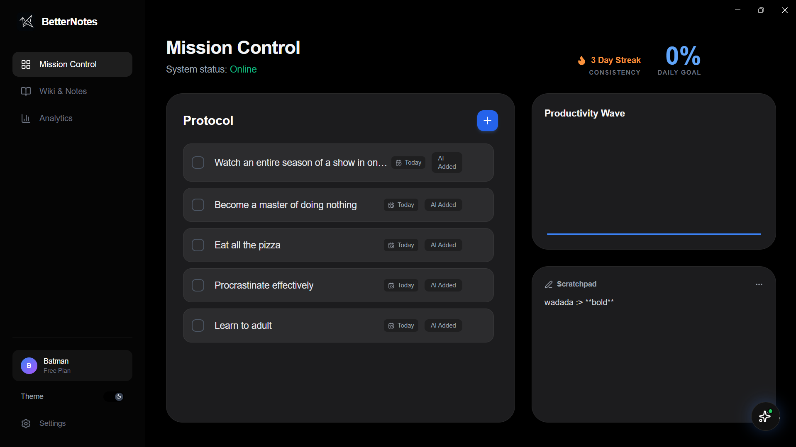
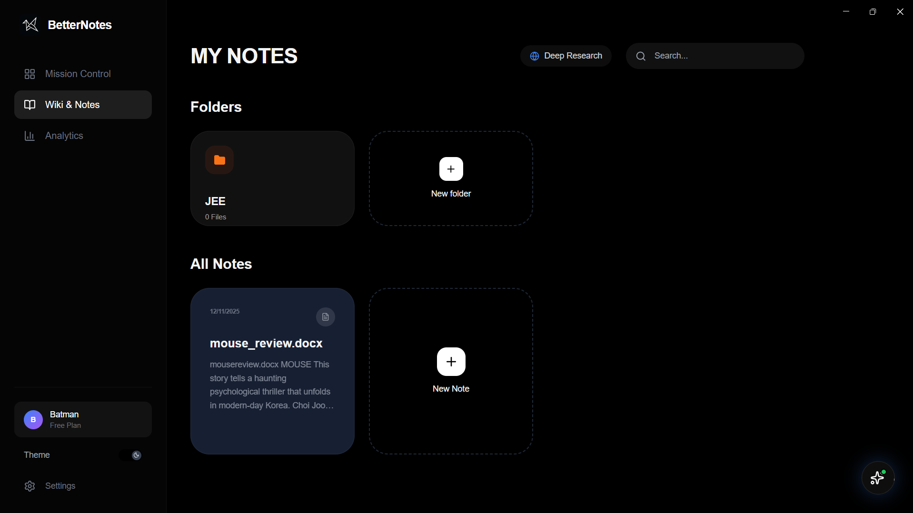
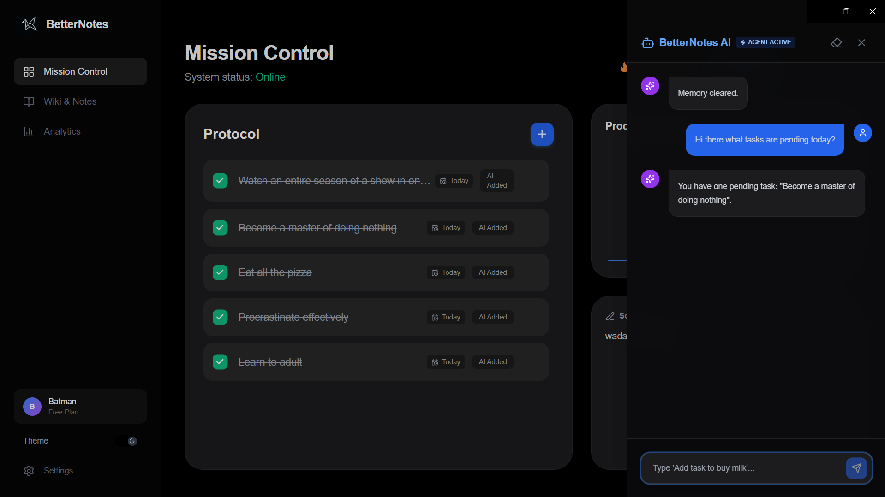

<div align="center">
  <br />
    <a href="https://github.com/AdhirajPersonal/BetterNotes">
      
    </a>
  <br />

  <h1>BetterNotes</h1>

  <p>
    <b>notes but better.</b>
  </p>

  <p>
    <a href="https://github.com/AdhirajPersonal/BetterNotes/releases/latest">
      
    </a>
    
    
    
  </p>

  <p>
    <!-- These links now target the invisible ID tags added below -->
    <a href="#features">Features</a> •
    <a href="#download">Download</a> •
    <a href="#development">Development</a> •
    <a href="#license">License</a>
  </p>

  <br />
</div>

<div align="center">
  
</div>

<br />

## 🚀 About

**BetterNotes** is a modern, open-source productivity workspace designed to be faster, smarter, and more private than Notion. 

It runs 100% locally on your machine. No cloud delays, no subscription fees for basic features, and you own your data (JSON format). It integrates the raw power of **Groq AI (Llama 3 / GPT-OSS 120b)** to perform deep internet research, automate tasks, and refine your writing instantly.

<br />

<!-- ANCHOR FOR FEATURES -->
<a id="features"></a>
## ✨ Key Features

### 🧠 AI That Actually Does Things
*   **Deep Research Agent:** Ask a question, and the AI browses the live web to compile a detailed markdown report with citations.
*   **Context-Aware Chat:** A sidebar assistant that "sees" your current note and dashboard tasks.
*   **Agentic Actions:** Tell the AI to *"Create a task to buy milk"* or *"Make a new folder for Work"*, and it controls the app interface for you.

### 📝 Powerful Wiki & Editor
*   **Slash Commands:** Type `/` to insert headers, checklists, dividers, or trigger AI summaries.
*   **Smart Drag & Drop:** Drop **PDFs, Word Docs, or Text files** directly into the editor to append them, or into the grid to create new notes instantly.
*   **Markdown Native:** Fast, clean typing experience with instant formatting.

### 📊 Mission Control
*   **Habit Tracking:** Automatic GitHub-style consistency grid based on your task completion.
*   **Productivity Wave:** Real-time visualization of your daily output.
*   **Persistent Scratchpad:** A quick-capture area that auto-saves everything.

### 🎨 Premium UI/UX
*   **Cinematic Boot Sequence:** A satisfying startup animation.
*   **Glassmorphism Design:** Modern, fluid animations using Framer Motion.
*   **Global Command Bar:** Press `Ctrl+K` to navigate anywhere or trigger actions instantly.
*   **Themes:** Pixel-perfect Dark and Light modes.

<br />

<div align="center">
  
  
</div>

<br />

<!-- ANCHOR FOR DOWNLOAD -->
<a id="download"></a>
## 📥 Download

**Windows:**
Download the latest `.exe` installer from the [Releases Page](https://github.com/AdhirajPersonal/BetterNotes/releases).

*(Mac & Linux builds coming soon)*

<br />

<!-- ANCHOR FOR DEVELOPMENT -->
<a id="development"></a>
## 🛠️ Development

Built with the **Modern Electron Stack**:
*   **Core:** Electron, React, TypeScript, Vite
*   **Styling:** TailwindCSS, Shadcn Concepts
*   **Animation:** Framer Motion
*   **Charts:** Recharts
*   **AI:** Groq SDK

### Setup

```bash
# 1. Clone the repo
git clone https://github.com/AdhirajPersonal/BetterNotes.git

# 2. Install dependencies
npm install

# 3. Run Development Mode
npm run dev

# 4. Build for Windows
npm run build:win
```

## 🔐 Privacy & API Keys

BetterNotes is Local-First.
Your notes and tasks are stored in AppData on your computer.
We do not have a server. We do not track you.
To use AI features, you must provide your own Groq API Key (Free tier available) in the Settings menu. The key is stored securely on your device.

## 🤝 Contributing

Contributions are welcome! Feel free to submit a Pull Request.
- Fork the Project
- Create your Feature Branch (git checkout -b feature/AmazingFeature)
- Commit your Changes (git commit -m 'Add some AmazingFeature')
- Push to the Branch (git push origin feature/AmazingFeature)
- Open a Pull Request

## 📄 License

Distributed under the MIT License. See LICENSE for more information.
<div align="center">
Made with ❤️ by <b>Adhiraj</b>
</div>
